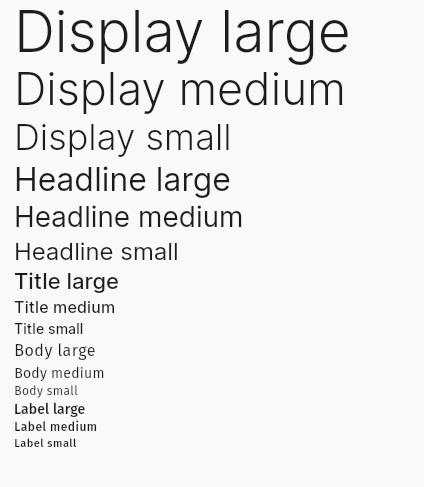

# Introduction

**Aria** is a simple theme for customize Flutter Material app using [_Material Color Utilities_](https://pub.dev/packages/material_color_utilities)

## Getting started

Add `Aria` package in your pubspec.yaml file

```yaml
dependencies:
  aria:
    git: https://github.com/tkrii/aria_flutter.git
```

```dart
import 'package:aria/aria.dart';
```

## Features

#### createTextTheme



Customize yor app fonts with `createTextTheme` function

This use [Fira Sans](https://fonts.google.com/specimen/Fira+Sans) for body and labels, and [Inter](https://fonts.google.com/specimen/Inter) for heading and titles

```dart
TextTheme textTheme = createTextTheme(textColor);
    
```

#### createAriaTheme

Create base of aria using custom `ColorScheme`; for example, the callback of [**Builder widget**](https://pub.dev/packages/dynamic_color#builder-widget) of **dynamic_color** package

```dart
// This theme content aria createTextTheme fonts from default
ThemeData customTheme = createAriaTheme(
    customColorScheme, 
);

Theme(
  data: customTheme,
  child: ... // Any widget
);
```

#### AriaTheme class

**AriaTheme** is simple to use, only need a primary, if you need other values for secondary and tertiary color, you can put then.
```dart
AriaTheme aria = AriaTheme(
  primary: Color(0xff28bca3), // default Color(0xff3689e6)
  // secondary: analogous of primary from default
  // tertiary: contrasting of primary from default
);

MaterialApp(
  ...
  theme: aria.light(),
  darkTheme: aria.dark(),
  highContrastTheme: aria.light(1),
  highContrastDarkTheme: aria.dark(1),
  ...
);
```

<!-- ### Extensions -->

## License
Aria is [MPL licensed](LICENSE)